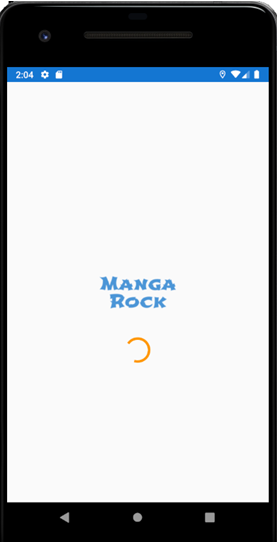
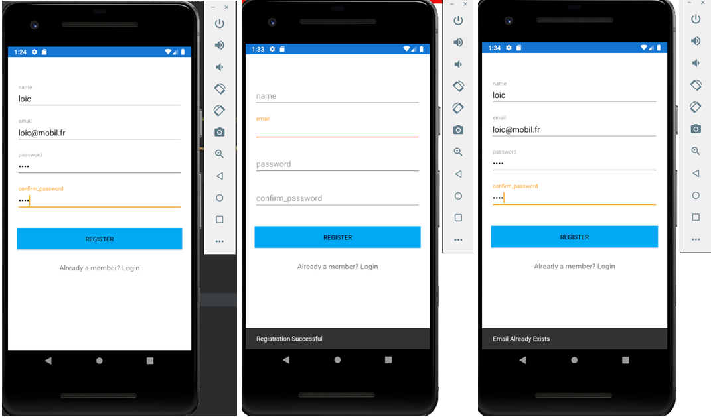
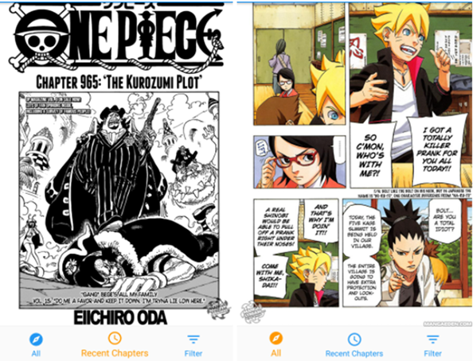
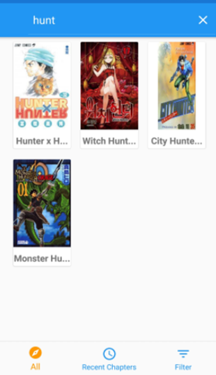
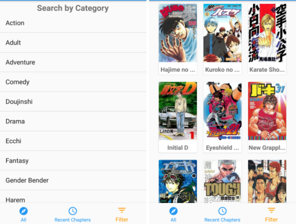

# Projet_Mobile_4A
## AUTEUR:
KAMGUIA KOUAM LOIC CERDY
(4A SI2)

## Présentation

Grand passionné de mangas, j’ai fait ce projet dans le but de partager ma passion pour les mangas avec les lecteurs, les amateurs et surtout les amoureux de mangas. (Et même avec vous ;) !!)

Vous l’avez sans doute deviné, le but de cette application sera d’offrir aux lecteurs des scannes de mangas à la demande, de voir les détails de ces mangas, de lire les chapitres correspondant à ces mangas, d’informer les utilisateurs sur les nouvelles sorties de mangas (en virons chaque 2 à 3 semaines) et de donner la possibilité de les lire si jamais ils sont intéressés. 

## En résumé

Dans la première activité, vous devez vous authentifier avant d’accéder à l’écran d’accueil. Si vous n’êtes pas membre, vous devriez obligatoirement vous inscrire. Après l’enregistrement, vous pouvez vous connecter et ainsi arriver à écran d’accueil. Une fois dans l’écran d’accueil vous prouvez naviguer et accéder de façon illimitée à des centaines de scannes et d’actualités mangas.  

## Voici l’organisation de l’application : 
-	1 écran SplashScreen
-	1 écran d’authentification
-	1 écran d’inscription
-	1 écran (pour valider la connexion de l’utilisateur)
-	1 écran d’accueil qui affiche tous les nouveaux mangas : dans cet écran il est possible d’accéder aux détails de chaque manga
-	1 écran recent chapters : qui affiche les mangas en cours de lecture
-	1 écran filter ou l’on peut voir les mangas par catégories : dans chaque catégorie se trouve une liste de manga, et il est possible d’accéder au détail de chaque manga. Dans cet écran se trouve une barre de recherche pour trouver plus rapidement un élément de la liste.

## Consignes respectées :
-
	- Appel WebService à une API Rest. (API utilisée : https://www.mangaeden.com/api/ )  //devenu instable
	- Ecran avec une liste d’éléments
  - Ecran avec le détail d’un élément
  - Stockage de données en cache

- Fonctions supplémentaires :
	- Architecture MVVM
  - Architecture Components (Livedata, ViewModel, Room + SQLite pour stocker les données)
  - 2 bases de données SQLite (1bsd pour les mangas et 1 autre pour les utilisateurs)
  - RxJava
  - Fonctionnalités de l'appli (searchview, filtres, lecture)
  - Utilisation de fragments
  - Bottom Navigation
  - Design

## Fonctionnalités: 

## SplashScreen

## Inscription : (on observe bien le stockage en local des données)

## Connexion failed : (on teste une connexion avec un mauvais mot de passe)

## Connexion réussie après enregistrement de l’utilisateur

### Ecran Home 

- Affiche la liste de tous les mangas (limité à 1000)

### Ecran du détail du manga
Affiche : l'image, le nom de l'auteur, la description du manga, liste des catégories dans lesquelle se place le manga
et enfin une liste des 100 (ou moins) derniers chapitres du manga

                  

En appuyant sur un chapitre, un nouveau fragment s'ouvre, permettant de lire chapitre (gallerie d'images)

 

### Filtres
Filtre par nom de manga

Filtre par genres (par exemple ici ne voir que les mangas de sport)

         

### Chapitres Récents
Réutilisation du fragments d'affichage de liste de chapitres mais cette fois ci pour afficher,
quelque soit le manga, son (ses) chapitre(s) sorti(s) récemment s'il y en a.

## Appris

- Programmation réactive (découverte de RxJava)
- Utilisation de base de données sqlite pour une application android (Room, DAO, entity, database...)
- Utilisation de Livedata
- Utilisation de fragments

## Objectifs Futurs
- Kotlin
- firebase
- CI/CD
- Chat
