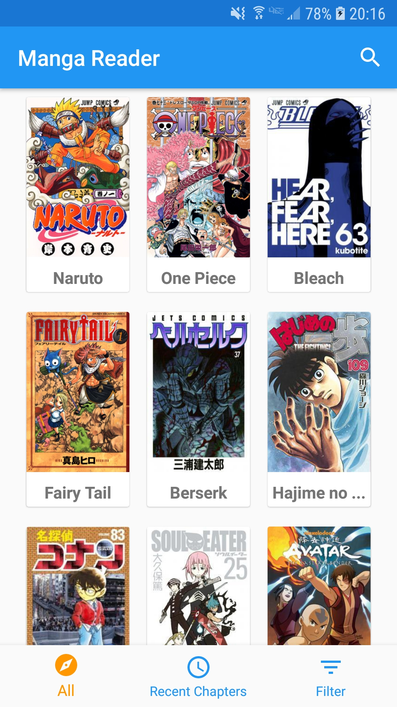
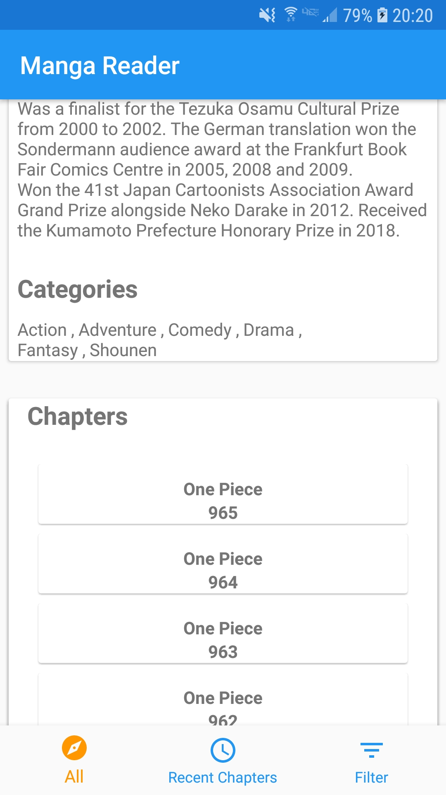
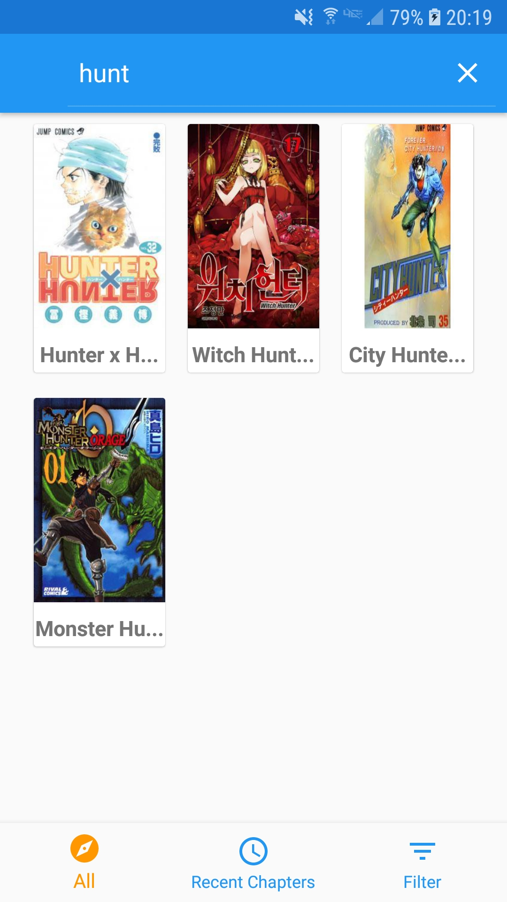
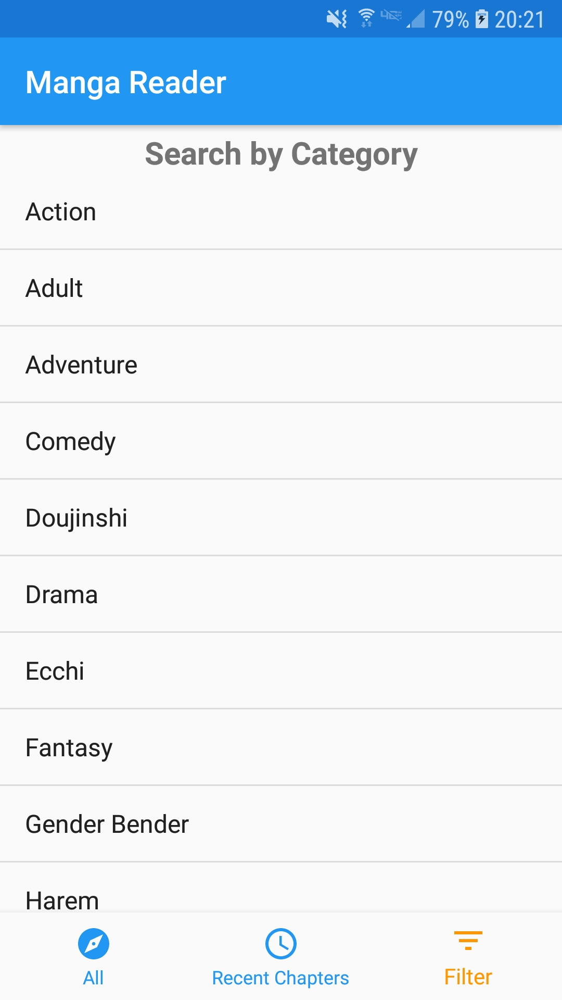
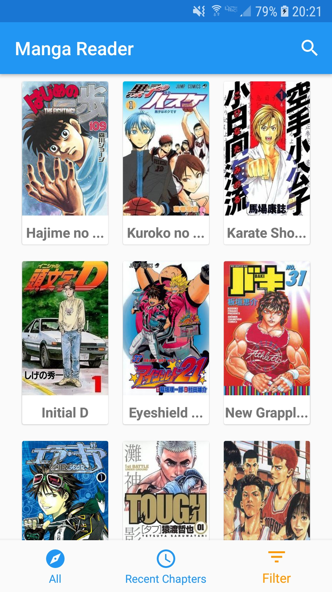
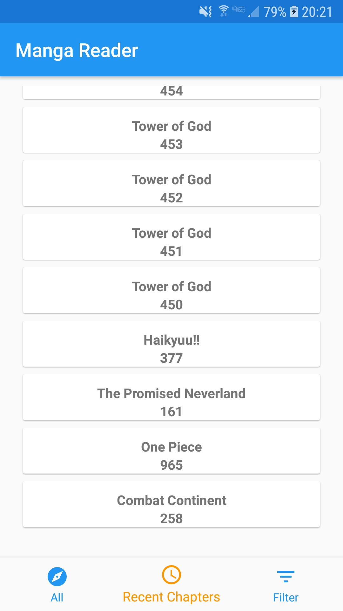

# Projet_Mobile_4A
## AUTEUR:
KAMGUIA KOUAM LOIC CERDY
(4A SI2)

## Présentation

Projet démontrant l'utilisation de Clean Architecture et du pattern MVVM dans une application android codé en Java.

Cette application pemet de trouver des mangas, voir les détails les concernant, et lire les chapitres de ces mangas.
Une section permet aussi de voir les chapitres de mangas sortis récemment (dans les 2 dernières semaines) et ainsi les lire.

## Consignes respectées :
-
	- Utilisation de fragments
	- Appel WebService à une API Rest. (API utilisée : https://www.mangaeden.com/api/ )
	- Stockage des données en cache.
  - Design
  - Gitflow
  - Bottom Navigation

- Fonctions supplémentaires :
	- Architecture MVVM
  - Architecture Components (Livedata, ViewModel, Room + SQLite pour stocker les données)
  - RxJava
  - Fonctionnalités de l'appli (searchview, filtres, lecture)

## Fonctionnalités: 

### Ecran Home 

- Affiche la liste de tous les mangas (limité à 1000)

### Ecran du détail du manga
Affiche : l'image, le nom de l'auteur, la description du manga, liste des catégories dans lesquelle se place le manga
et enfin une liste des 100 (ou moins) derniers chapitres du manga

                   

En appuyant sur un chapitre, un nouveau fragment s'ouvre, permettant de lire chapitre (gallerie d'images)

                                      

### Filtres
Filtre par nom de manga

Filtre par genres (par exemple ici ne voir que les mangas de sport)

                

### Chapitres Récents
Réutilisation du fragments d'affichage de liste de chapitres mais cette fois ci pour afficher,
quelque soit le manga, son (ses) chapitre(s) sorti(s) récemment s'il y en a.

## Appris

- Programmation réactive (découverte de RxJava)
- Utilisation de base de données sqlite pour une application android (Room, DAO, entity, database...)
- Utilisation de Livedata
- Utilisation de fragments
